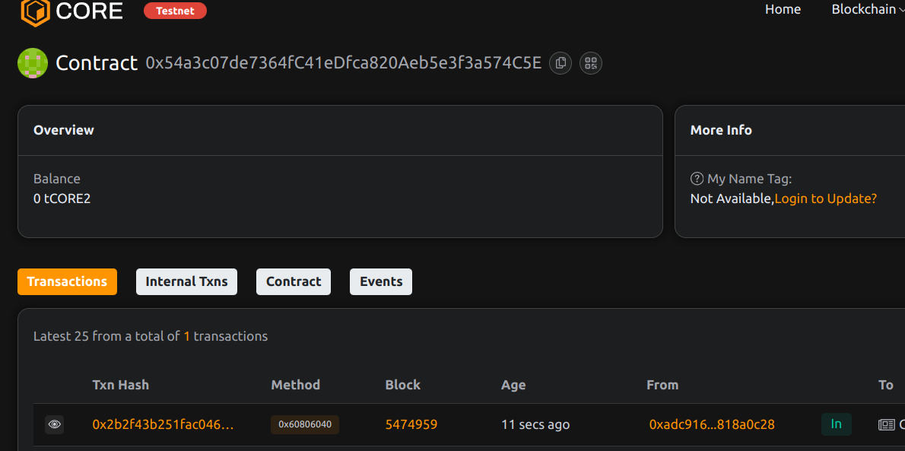

# LoanLink: P2P Lending Platform Using On-Chain Credit Scores

## Project Description
LoanLink establishes a decentralized peer-to-peer lending protocol that leverages on-chain credit scoring to facilitate trustless loans. The system connects lenders with qualified borrowers while automatically adjusting creditworthiness based on repayment history.

## Project Vision
To create a financial ecosystem where:
- Creditworthiness is transparent and portable
- Lending happens without intermediaries
- Reputation is built on-chain
- Global access to capital is democratized

## Key Features
- On-chain credit scoring system
- Collateral-free lending
- Dynamic interest rates
- Automated reputation building
- Non-custodial fund management
- Default risk mitigation

## Future Scope
- Integration with DeFi protocols
- Credit score oracles
- Loan insurance pools
- Credit delegation system
- Cross-chain lending markets

## Contract Details
0x54a3c07de7364fC41eDfca820Aeb5e3f3a574C5E

